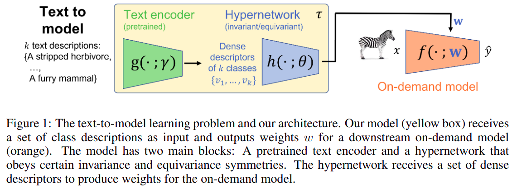
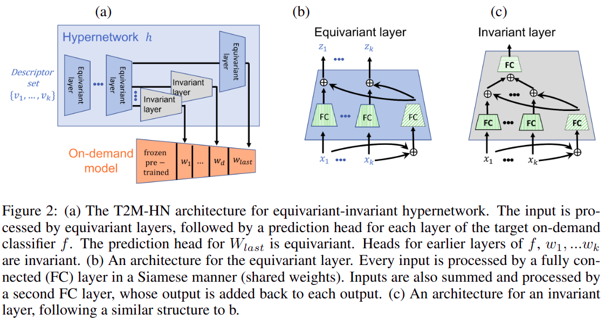
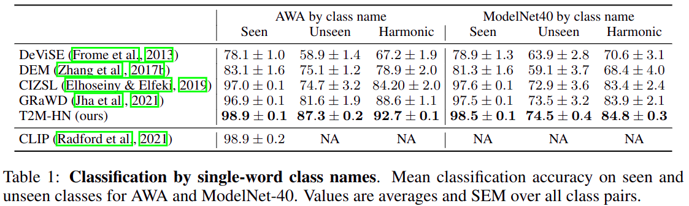
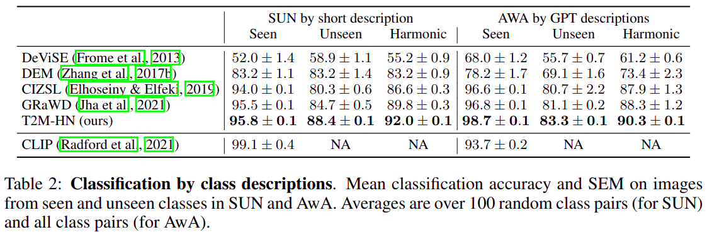
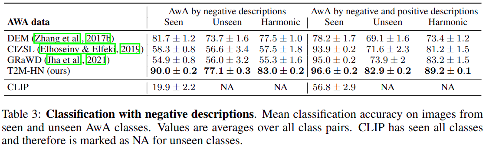

# Text2Model 

Official implementation of ["_Text2Model: Model Induction for Zero-shot Generalization Using Task Descriptions_"](https://arxiv.org/abs/2210.15182).

We study the problem of generating a training-free task-dependent visual classifier from text descriptions without visual samples. 
We analyze the symmetries of T2M, and characterize the equivariance and invariance properties of corresponding models. In light of these properties we design an architecture based on hypernetworks that given a set of new class descriptions predicts the weights for an object recognition model which classifies images from those zero-shot classes. 
We demonstrate the benefits of our approach compared to zero-shot learning from text descriptions in image and point-cloud classification using various types of text descriptions: From single words to rich text descriptions.

### The text-to-model learning problem and our architecture
<p align="center"> 
    
</p>

### T2M-HN architecture
<p align="center"> 
    
</p>


### Main results
<p align="center"> 
    
</p>

<p align="center"> 
    
</p>

<p align="center"> 
    
</p>


## Installation 
### Install Docker
- ```sudo apt  install docker.io```
- ```sudo groupadd docker```
- ```sudo usermod -aG docker $USER```
- ```newgrp docker```
### Pull and run the docker image
- ```docker pull amosy3/t2m:latest```
- ```docker run --rm -it -v $(pwd):/data:rw --name text2model amosy3/t2m:latest```

## Get code and data
- ```git clone https://github.com/amosy3/Text2Model.git```
- ```cd Text2Model```
- ```wget https://chechiklab.biu.ac.il/~amosy/awa.zip```
- ```unzip awa.zip```
- ```wget https://chechiklab.biu.ac.il/~amosy/cub.zip```
- ```unzip cub.zip```
- ```wget https://chechiklab.biu.ac.il/~amosy/sun.zip```
- ```unzip sun.zip```
- ```wget https://chechiklab.biu.ac.il/~amosy/gpt_label2descriptors.pkl```
- ```wget https://chechiklab.biu.ac.il/~amosy/label2attributes_names.pkl```


## Run an experiment
- Use ```wandb login``` to login to your wandb account. You will be asked to paste an API key from your profile. It can be found under Profilie-> Settings-> API keys
- ```git config --global --add safe.directory /data```
- ```python main.py --batch_size=64 --hn_train_epochs=100 --hnet_hidden_size=120 --inner_train_epochs=3 --lr=0.005 --momentum=0.9 --weight_decay=0.0001 --text_encoder SBERT --hn_type EV```


