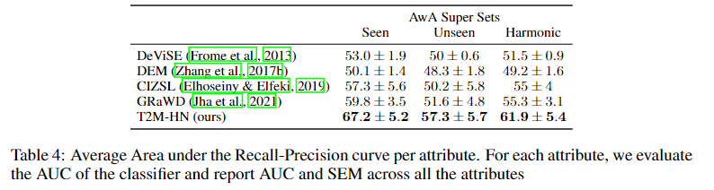

# Beyond Individual Classes

The code for the experiment "Beyond Individual Classes" (Section 4.4 in the paper).

<p align="center"> 
    
</p>

## Get code and data
- Extract the file 'awa.zip' to the current directory.

## Run an experiment
- Use ```wandb login``` to login to you wandb account
- Run: ```python main.py --batch_size=64 --hn_train_epochs=100 --hnet_hidden_size=120 --inner_train_epochs=3 --lr=0.005 --momentum=0.9 --weight_decay=0.0001 --hn_type W```

